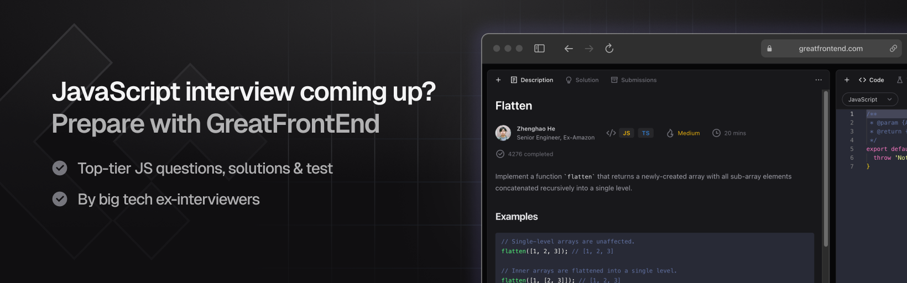

# Hi I'm Yangshun

📍 Singapore &middot; ✨ AI Frontend Engineer &middot; 🚀 Building [GreatFrontEnd](https://www.greatfrontend.com/) &middot; Ex-Meta Staff Engineer &middot; Creator of Docusaurus 2

## Building

- [NUSMods](https://github.com/nusmodifications/nusmods) (664 ⭐): Student-initiated course planning platform for National University of Singapore that the school officially endorsed
- [lago](https://github.com/yangshun/lago) (3k ⭐): Data Structures and Algorithms library in TypeScript
- [tree-node-cli](https://github.com/yangshun/tree-node-cli) (266 ⭐): Node.js equivalent of Linux's `tree` command. List directory contents in a tree-like format from CLI or Node.js
- [delete-github-forks](https://github.com/yangshun/delete-github-forks) (236 ⭐): Bulk delete your GitHub forks easily
- [create-ts-fast](https://github.com/yangshun/create-ts-fast) (81 ⭐): CLI tool for scaffolding npm packages in TypeScript
- [reclassify](https://github.com/yangshun/reclassify) (76 ⭐): Construct `className` strings directly in JSX without using clsx() / className()
- [greatstorage](https://github.com/yangshun/greatstorage) (71 ⭐): Supercharge `localStorage`. Dtore any data type, key expiration, namespacing, and schema validation
- [keyboards.css](https://github.com/yangshun/keyboards.css) (71 ⭐): Front end library-themed keyboards built using Tailwind CSS
- [Polytask](https://github.com/yangshun/polytask) (15 ⭐): Linear-inspired app centered around commands – keyboard shortcuts, command palette, and AI chat

## Writing

- [Tech Interview Handbook](https://github.com/yangshun/tech-interview-handbook) (138k ⭐): Curated coding interview preparation materials for busy software engineers
- [Front End Interview Handbook](https://github.com/yangshun/front-end-interview-handbook) (44k ⭐): Front end interview preparation guide for busy engineers
- [greatfrontend/awesome-front-end-system-design](https://github.com/greatfrontend/awesome-front-end-system-design) (8k ⭐): Curated front end system design resources for interviews and learning
- [greatfrontend/top-javascript-interview-questions](https://github.com/greatfrontend/top-javascript-interview-questions) (9k ⭐): Top JavaScript interview questions and answers for Front End Engineers
- [greatfrontend/top-reactjs-interview-questions](https://github.com/greatfrontend/top-reactjs-interview-questions) (5k ⭐): Most important React.js interview questions for busy Front End Engineers

## Past projects

- [facebook/docusaurus](https://github.com/facebook/docusaurus) (63.9k ⭐): Simple and extensible documentation website generator, powers Meta's open source project websites
- [facebook/flux](https://github.com/facebookarchive/flux) (17.5k ⭐): The first state management library for React
- [facebook/infima](https://github.com/facebookincubator/infima) (443 ⭐): CSS framework for documentation websites (built for Docusaurus)

## GitHub activity

## Try GreatFrontEnd

